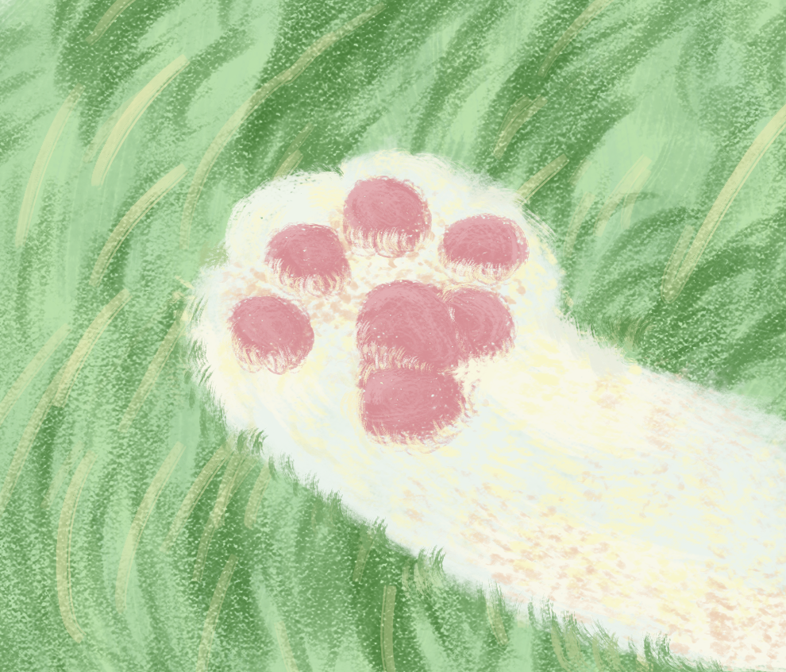

 

<h1 align="center">🐾 Wardiere – Pet Shop</h1>

Bem-vindo ao repositório da **Wardiere**, um pet shop pensado com amor para todos os tipos de animais! Aqui você encontra uma seleção de produtos e acessórios para cuidar do seu pet com carinho, qualidade e responsabilidade.

## 📌 Sobre o Projeto

Este projeto é uma plataforma fictícia de pet shop chamada Wardiere, desenvolvida durante a residência em TIC no Serratec. A aplicação simula um e-commerce completo para PetShop online, oferecendo uma experiência integrada de navegação, visualização de produtos, cadastro e gerenciamento. O site contempla funcionalidades específicas para clientes e funcionários, e está conectado a uma API própria desenvolvida anteriormente no curso.

## 💡 Funcionalidades

- Página inicial com destaques, promoções e categorias
- Cadastro e login de clientes 
- Cadastro e login de funcionarios
- Validação no login que redireciona o usuário conforme o tipo:  
  - Cliente é direcionado para a home para realizar compras  
  - Funcionário é direcionado para o painel administrativo para gerenciar produtos e categorias 
- Área “Quem Somos” com informações sobre a equipe que desenvolveu o projeto
- Integração completa com API para gerenciamento de produtos, categorias e usuários  
- Sistema de autenticação e autorização para controle de acesso conforme tipo de usuário
- Navegação dinâmica com botão de "Usuário" ou "Cadastre-se", dependendo do login

- **Cliente** pode:  
  - Navegar e buscar produtos com barra de pesquisa  
  - Visualizar descrição dos produtos  
  - Adicionar produtos ao carrinho  
  - Alterar quantidade ou remover itens do carrinho  
  - Visualizar produtos em promoção  

- **Funcionário** pode:  
  - Cadastrar e gerenciar produtos  
  - Cadastrar e gerenciar categorias  
  - Não pode adicionar produtos ao carrinho
 

## 🧩 Tecnologias Utilizadas

| Tecnologia | Descrição |
|------------|-----------|
|  **HTML5** | Estrutura base do site com marcação semântica |
|  **CSS3** | Estilização geral da aplicação com organização visual |
|  **JavaScript** | Lógica de interações, carrinho, favoritos e navegação |
|  **ReactJS** | Biblioteca para construção da interface, gerenciamento de estado e controle de rotas |
|  **Node.js (API)** | Backend que serve a API, conecta com o banco de dados e gerencia os dados do sistema |
|  **Java + Spring Boot** | Framework usado em projeto anterior para construir a API REST que fornece os dados|
|  **React Router DOM** | Controle das rotas para navegação entre páginas da aplicação |
|  **useState / useEffect** | Hooks do React para gerenciamento de estado e efeitos colaterais |
| **Axios** | Biblioteca para fazer requisições HTTP à API |
|  **LocalStorage** | Armazenamento local usado para manter o carrinho e o token JWT entre sessões |

## 🔗 Integração com API

O site se conecta à API REST desenvolvida em Java + Spring Boot para realizar todas as operações relacionadas a produtos, categorias, autenticação e usuários. A API fornece os dados que são exibidos e manipulados no front-end ReactJS.

## 📁 Estrutura do Projeto
      
│ scr/      
├── assets/ # Imagens e ícones   
├── components/ # Componentes reutilizáveis   
├── pages/ # Páginas da aplicação      
├── routes/ # Definição das rotas da aplicação (navegação entre páginas)  
├── services/ # Requisições à API        
└── App.jsx # Componente principal      
      
## 👩‍💻 Desenvolvedores

Equipe responsável pelo desenvolvimento do projeto **Wardiere – Pet Shop**:

| Nome              | LinkedIn                                                                 | GitHub                        |
|-------------------|--------------------------------------------------------------------------|-------------------------------|
| Maria Araguão     | [Maria Araguão](https://www.linkedin.com/in/maria-arag%C3%A3o-b136822b2) | [@Maria-S-Aragao](https://github.com/Maria-S-Aragao) |
| José Netto        | [José Netto](http://linkedin.com/in/jcboaretto)                          | [@jcboaretto](https://github.com/jcboaretto)         |
| Lívia Raissinger  | [Lívia Raissinger](https://www.linkedin.com/in/liviaraissinger)          | [@Livia9](https://github.com/Livia9)                 |
| Nathan Gomes      | [Nathan Gomes](https://www.linkedin.com/in/nathan-gomes-707162270)       | [@NathandGomes](https://github.com/NathandGomes)     |
| Thais Costa       | [Thais Costa](https://www.linkedin.com/in/thais-costa-da-silva-9a4914291/)| [@tatacost](https://github.com/tatacost)            |
